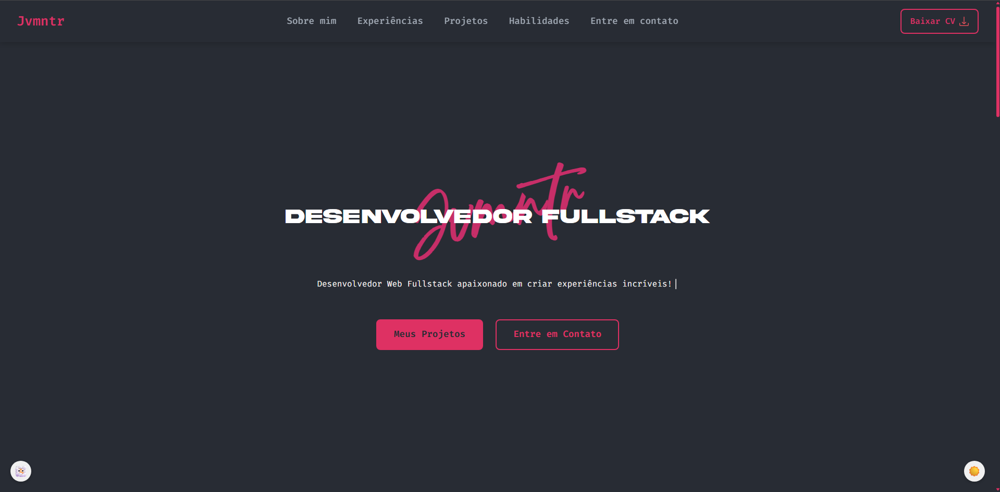

<h1 align="center">
  👨🏻‍💻   Portfólio - Jvmntr
</h1>

 
 
  
 
 
 
 

<h4 align="center"><a href="https://jvmntr.github.io/portfolio/">Clique para visitar o projeto</a></h4>

## 📄 Seções

Seções do portfólio:

* **Home:** Apresentação breve e objetiva para introduzir o portfólio;
* **Sobre mim:** Nessa seção trago um resumo pessoal sobre minha trajetória e interesses;
* **Experiências Profissionais:** Destaco empresas onde atuei.;
* **Experiências Acadêmicas** Seção dedicada as minhas formações acadêmicas.;
* **Projetos:** Mostra alguns projetos desenvolvidos, com links diretos para os repositórios no GitHub;
* **Habilidades:** Exibe em cards as tecnologias e áreas nas quais tenho domínio;
* **Entre em contato:** Espaço dedicado para contato.;

## 💼 Tecnologias utilizadas

- ReactJS;
- Typescript;
- Styled-components;
- Jest 

## ✒️ Feito por:

**Feito com 🖤 por João 'Jvmntr' Monteiro** \
[**Desenvolvedor fullstack**]    

 
