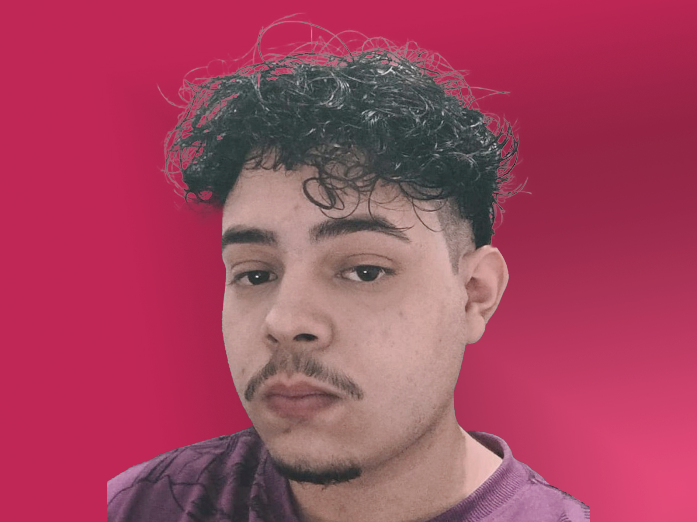

# 👨🏻‍💻 Portfólio

  
 
 
 

> Portfólio feito com React, Typescript e styled-components   
> Acesse aqui -> Aguarde a publicação.

## ⚙️ Checklist de desenvolvimento

Atualização de desenvolvimento do projeto

### ✔️ Concluído ->

- [X] Desenvolvimento da Nav e Hero section.
- [X] Implementação do light/dark mode.
- [X] Desenvolvimento da seção sobre mim.
- [X] Desenvolvimento das seções de experiência profissional e acadêmica.
- [X] Desenvolvimento da seção de projetos.
- [X] Desenvolvimento da seção de habilidades.
- [X] Desenvolvimento da seção do Footer.

### 🛠 Próximos passos ->

- [ ] Implementação da lógica de download do curriculo.
- [ ] Implementar indicativo de swipe mobile.
- [ ] Implementação de testes unitários com Jest.

> Data prevista para publicação -> 20/06/2025

## ✒️ Feito por:

**Feito com 🖤 por João 'Jvmntr' Monteiro** \
[**Desenvolvedor fullstack**]    

 
